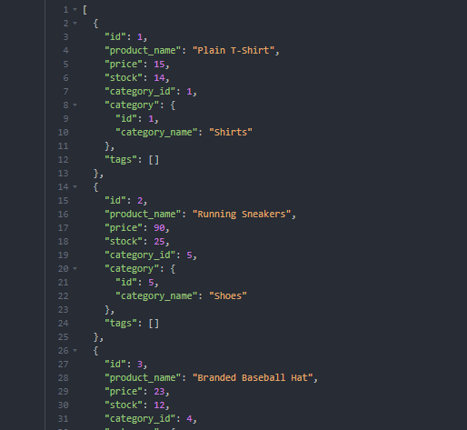

# Team-Profile-Generator
# Description
### This application is a neat tool which allows you to keep inventory of your store all by yourself! It's a command line based application that I created using Javascript, the whole process takes place in various files within the repo. After answering setting up the server you can get, post, update and delete data from your store's database!

Click image for a demo of my E-Commerce Back End
<a href="https://watch.screencastify.com/v/LkJRV2i5TbHwiT76kaPK"></img></a>

https://github.com/jaredinyaagha1/E-Commerce-Back-End